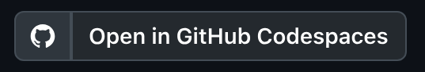
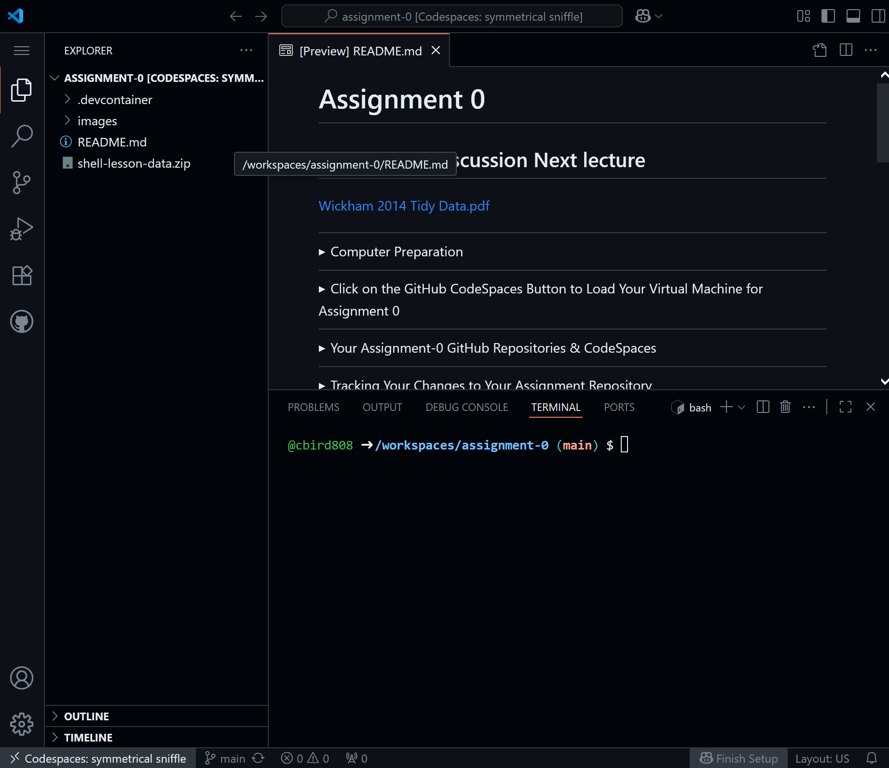
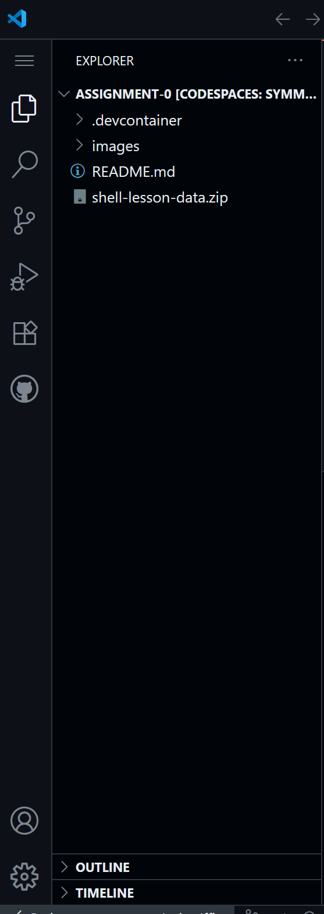
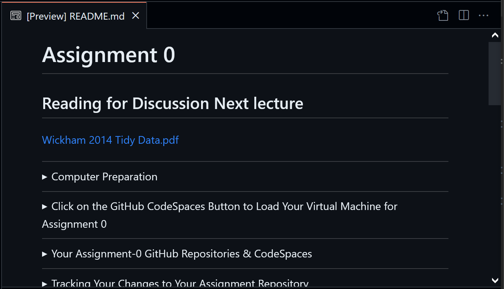
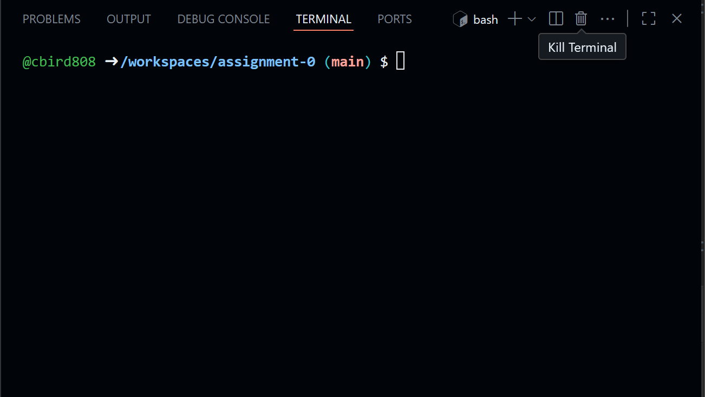
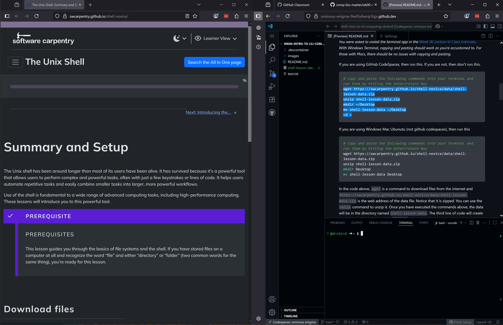
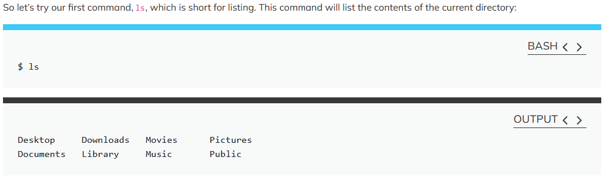
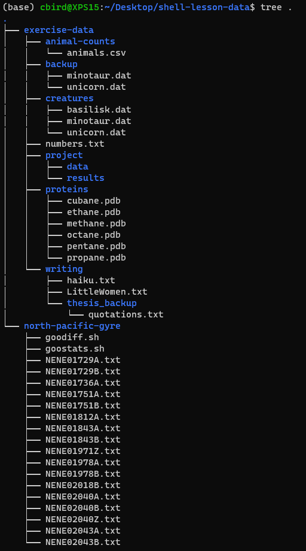
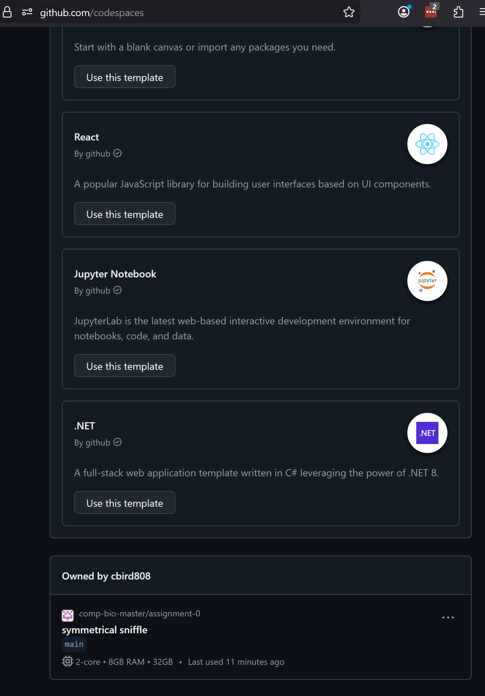

# Assignment 0: Intro to CLI Computing

Read this through and work through [Software Carpentry's The Unix Shell](https://swcarpentry.github.io/shell-novice/) lesson from "Introducing the Shell" through "Working with Files and Directories".

---

## Overview

In a nutshell:

1. Click the assignment invite link to create your personalized assignment repo
2. Click the CodeSpaces Link in the Repo
3. Unzip the `shell-lesson-data`, create the `Desktop` dir in you home dir (`~`), move the `shell-lesson-data` dir to `~/Desktop`, change your directory to the `shell-lesson-data` dir
4. Open the Software Carpentry lesson, split screen between Software Carpentry and Codespaces 
5. Start at "1. Introducing the Shell" and stop after completing "3. Working with files and directories"
6. Move your `shell-lesson-data` dir back to the repo
7. Use `git` to `add`, `commit`, and `push` the changes to the repo back to the primary copy on github.

I suggested you carefully read through the information below and follow the instructions to complete these tasks while also gaining an understanding of how everything involved in the assignment works.

---

<details><summary>Computer Preparation</summary>
<p>

## Computer Preparation

Use GitHub CodeSpaces to complete this assignment.  

If you did not yet set up GitHub CodeSpaces (we did it in [Lecture 0](https://github.com/tamucc-comp-bio/classroom_repo_2025/blob/main/lectures/lecture00.md)) then do that now: [Instructions](https://github.com/tamucc-comp-bio/how_to/blob/main/howto_github_codespaces.md)

 </p>
</details>

---

<details><summary>Click on the GitHub CodeSpaces Button to Load Your Virtual Machine for Assignment 0</summary>
<p>

## Click on the GitHub CodeSpaces Button to Load Your Virtual Machine for Assignment 0



It will take a minute for the CodeSpaces virtual machine to load.  Once it's loaded, you should see this on your screen:



In the codespaces window, the side panel shows the files and directories in the assignment repo.



The upper panel is a file viewer/editor and it should be showing you this `README.md` file that you are reading.



The lower panel is an Ubuntu terminal.  I specifically set up your virtual machine to have Ubuntu because that's all you need for this assignment.



If everything is making sense up to here, then you have successfully loaded the GitHub repo for Assignment 0 to your CodeSpaces virtual machine.  

 </p>
</details>


---

<details><summary>Setup the Data for This Assignment (Do Not Follow The Download Instructions on Software Carpentry)</summary>
<p>

## Setup the Data for This Assignment (Do Not Follow The Download Instructions on Software Carpentry)

I have already **downloaded the data file for the lesson** (`shell-lesson-data.zip`) to the assignment repo.  Copy and paste the following commands into your terminal and run them by hitting the <ENTER/RETURN> key.

1. Decompress the directories and files for the assignment

```bash
unzip shell-lesson-data.zip
```

2. Make a new directory called `Desktop` in the home directory of your VM

```
mkdir ~/Desktop
```

3. Move the unzipped dir to the Desktop dir in the home dir (needed for instructions in Software Carpentry to work)

```
mv shell-lesson-data ~/Desktop
```

4. Goto the home dir in your VM

```
cd ~
```

> [NOTE!]
> Unless you specifically set up keystrokes in CodeSpaces, you will have to use the mouse to copy and paste.

</p>
</details>

---

<details><summary>Assignment</summary>
<p>

## Assignment

We have a steep learning curve to traverse, so we are going to "flip" the classroom next week. Flipping the classroom means that you work on the material to be covered before we address it in lecture.  Then we can spend time in lecture going over the most challenging topics, as identified by you. Then we will continue together in lecture through new material that builds upon this assignment.

Your assignment is to work through [Software Carpentry's The Unix Shell](https://swcarpentry.github.io/shell-novice/) from "Introducing the Shell" through "Working with Files and Directories". 

> [NOTE!]
> You should set up your computer to have one window with your CodeSpaces terminal (or shell) and one with the software carpentry web page side by side)



Note that we have already completed the Download Files, Install Software, and Open a New Shell sections. Proceed directly to [1. Introducing the Shell](https://swcarpentry.github.io/shell-novice/01-intro.html)

Read through and complete the lessons. Everytime there's a code block (has a blue line across top), run the command in the code block into your terminal. The tutorial will also show you the expected output in the block with the black line across the top (don't type this in, only the commands under the blue lines).  

> [NOTE!]
> Don't type the $ in the code blocks.  That's the command prompt.



Refer to the helpful information below while you work through the Software Carpentry Lessons.

</p>
</details>

---

<details><summary>Resources to Help You Complete the Assignment</summary>
<p>

## Resources to Help You Complete the Assignment

I highly recommend that you print out the [Linux Cheat Sheet](https://github.com/tamucc-comp-bio/classroom_repo_2025/blob/main/resources/README.md) which I created for myself and my students when I was learning `bash`. Print it out and use it as a mousepad.  It's unique because it translates english into `bash`.

ChatGPT, Google Gemini, and Anthropic Claude are all useful AI large language models for assisting you in understanding the concepts in this assignment. They are really good at interpreting error messages for you.

</p>
</details>

---

<details><summary>Tips and Additions to The Unix Shell Lesson</summary>
<p>

## Tips and Additions to The Unix Shell Lesson

I made these notes, which are organized by the sections of the assignment, to help you navigate sticking points in the assignment and supplement the information provided by Software Carpentry.  

### 0. Picking Up From Where You Left Off.

If you stop in the middle of the assignment an need to get back to where you were, you need to navigate back there using the `cd` command.

Unfortunately, the CodeSpaces VM does not remember which directory you were in last if you stop and start it again.  

If you followed the instructions, then the `shell-lesson-data` dir is here: `~/Desktop/shell-lesson-data`, so the following command will get you there:

```bash
cd ~/Desktop/shell-lesson-data
```

### 1. [Introducing the Shell](https://swcarpentry.github.io/shell-novice/01-intro/index.html)

* If you are using GitHub CodeSpaces, after running `pwd` you should see `/home/vscode`

### 2. [Navigating Files and Directories](https://swcarpentry.github.io/shell-novice/02-filedir/index.html)

* those with Ubuntu running in windows won't have a `Desktop` dir unless you follow the data download instructions above. 
* realize that you will have your own home directory with your username.  It won't be named `nelle`
  
* use `ctrl+l` keystroke to clear the terminal (those with macs, try `command+l`).  that's a lower case `L`
* my favorite `ls` flags, aka options
  * `ls -ltrh` list all file details (`l`) with human readable file sizes (`h`) in reverse (`r`) chronological order (`t`)
  * `ls -lh`  list all file details (`l`) with human readable file sizes (`h`)
  * `ls -lhd */` list all file details (`l`) with human readable file sizes (`h`), but only directories (`d`) not files
  * I've never used the `-F` flag, frankly you don't need it

### 3. [Working With Files and Directories](https://swcarpentry.github.io/shell-novice/03-create/index.html)

* realize that the orange boxes don't always pertain to the directory structure in your lesson data.  For example, the 2nd one (Moving Files to a new folder) does not refer to our directory structure, but rather a hypothetical directory structure on Jamie's computer.  Who's Jamie?  idk

</p>
</details>

---

<details><summary>Self Check on Assignment</summary>
<p>

## Self Check on Assignment

If you did everything correctly, then the directory structure of your `shell-lesson-data` directory should look like that below.

You can check your work by visualizing your assignment directory tree with the following command and argument:

```bash
tree ~/Desktop/shell-lesson-data
```



</p>
</details>

---

<details><summary>Submitting Assignment</summary>
<p>

## Submitting Assignment

When you complete the assignment, run the following lines of code in your CodeSpaces terminal to save everything to the repo.

```bash
# goto the VM home dir
cd ~

# move your work back to the repo and goto the repo dir
# replace YourGitHubUserNameUserName with your GitHub user name.
mv Desktop /workspaces/wk00-assignment-0-YourGitHubUserNameUserName  
cd /workspaces/wk00-assignment-0-YourGitHubUserNameUserName 

# add, commit, and push to github
git add --all
git commit -m "submitting assignment"
git push
```

</p>
</details>

---

<details><summary>Your Assignment-0 GitHub Repositories & CodeSpaces</summary>
<p>


## Your Assignment-0 GitHub Repositories & CodeSpaces

Each student has their own assignment repository. It is private so that only you and Dr. Bird can see it.  Your personal assignment repo has been `cloned` into your Codespaces virtual machine and you are presumably reading this document (`README.md`) from that clone.

There is now one copy of your assignment in the primary GitHub repo which was created when you accepted this assignment, and there is another copy of your repo here in the CodeSpaces virtual machine.  

The location of your primary assignment repo is in this location: github.com/comp-bio-master/wk00-assignment-0-YourGitHubUserName.  Replace "YourGitHubUserName" with your GitHub username and you have the URL to that repository. You can bookmark that link for convenience, **BUT DO NOT EDIT THE PRIMARY COPY OF THE REPO**.

 </p>
</details>

---

<details><summary>Tracking Your Changes to Your Assignment Repository</summary>
<p>

## Tracking Your Changes to Your Assignment Repository

You will be editing your assignment repo in the CodeSpaces virtual machine.  The changes you make to your assignment repository here in the virtual machine are not immediatly applied to the primary copy. You have to explicitly use `git` to track the changes you've made, and then send them to the primary copy of the rep. 

Let's provide a demonstration.

0. Move to your assignment-0 repo dir

```
# replace YourGitHubUserName with your GitHub user name
cd /wk00-assignment-0-YourGitHubUserName
```

1. Use the `ls` command in your CodeSpaces terminal to print the directories and files in your assignment repo to the screen.

```bash
ls
```

2. Run this line of code in your CodeSpaces terminal to create a file named `my_first_file.txt`:

```bash
touch my_first_file.txt
```

3. Run `ls` again and you should now see `my_first_file.txt`

```bash
ls
```

4. If you take a look at your primary repo (github.com/comp-bio-master/wk00-assignment-0-YourGitHubUserName) and refresh the page, you will not see `my_first_file.txt`

5. We can track your changes in the copy of your assignment repo in your CodeSpaces virtual machine using `git add` and `git commit` and then send them to the primary copy of the repo using `git push`:

```bash
git add --all
git commit -m "completed first task")
git push  
```

6. If you take a look at your primary repo (github.com/comp-bio-master/wk00-assignment-0-YourGitHubUserName) and refresh the page, you will see `my_first_file.txt`

Congratulations!  You're now tracking the changes to your assignment repo in the CodeSpaces virtual machine.

 </p>
</details>

> [CAUTION!] 
> If you are confused after completing this section, then contact Dr. Bird.

---

<details><summary>CodeSpaces Dos and Don'ts</summary>
<p>

## CodeSpaces Dos and Don'ts

1. *Do* use `git add`, `git commit`, and `git push` to track you changes and back them up to the primary copy of the repository.

2. *Do* stop the virtual machine when you are not working on this assignment. [Instructions](https://github.com/tamucc-comp-bio/how_to/blob/main/howto_github_codespaces.md#-3-stopping-your-codespace)

3. *DO NOT* delete this virtual machine until you have pushed the changes you made in the virtual machine to the repo. Stopping the machine will not cause any problems. Deleting it will cause you to lose your work.

When you have completed the assigment you will `push` your changes to the primary copy of the repo.

 </p>
</details>

---

<details><summary>FYI: Additional Details About CodeSpaces Virtual Machines (VMs)</summary>
<p>

## FYI: Additional Details About CodeSpaces Virtual Machines (VMs)

* You can only have 2 VMs at any one time.  It doesn't matter if they are running or stopped as far as I know.
* If you need to spin up a third VM then you have to delete an existing virtual machine.  You can find your VM in your [CodeSpaces Page](https://github.com/codespaces) - scroll to the bottom. In the image below, I have 1 virtual machine name `symmetrical sniffle`



* If you dilligently `push` your changes to the primary github repo, then deleting a VM should not be a big deal beaause all of the important files are in the primary repo.
* There is a limitation on the number of hours you can run CodeSpaces VMs per month (30-45), so be sure to stop them when you are not using them.  [Instructions](https://github.com/tamucc-comp-bio/how_to/blob/main/howto_github_codespaces.md#-3-stopping-your-codespace)

</p>
</details>
